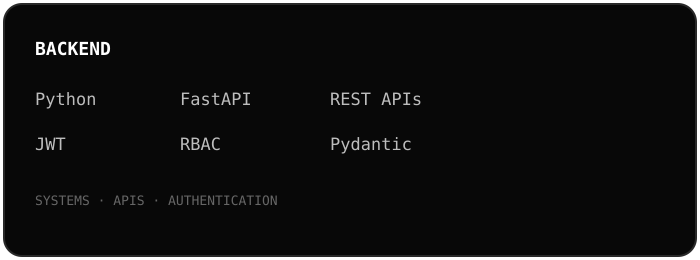
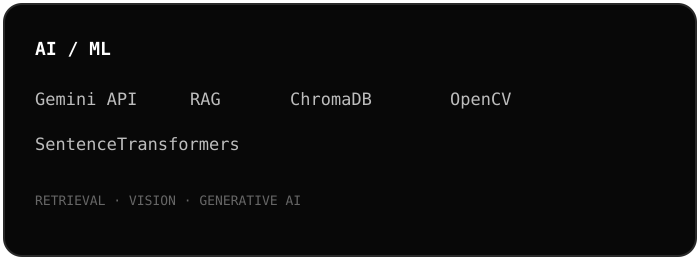
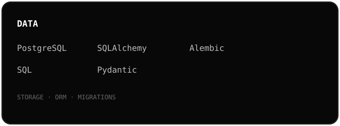
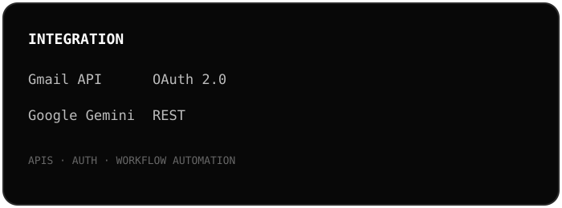
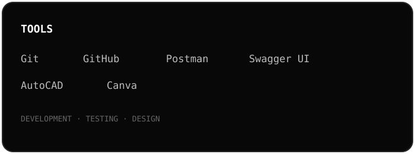

### Building systems. Automating impact.

 

 

---

## TECH STACK

 

---

## ACTIVITY

 

---

## PROJECTS

### EIGEN
**Building**

AI/RAG Systems · Workflow Automation · Custom AI Chatbots · Business Automation

Building AI systems, backend infrastructure and intelligent automation designed to solve real-world problems.

**ARCHER** — Enterprise AI Assistant  
**Email Automation** — Intelligent Workflow Automation

 

### AQUAPREDICT
**SIH 2026**

Researching a generalized, event-triggered hydrodynamic framework for dam-break inundation prediction and decision support.

 

### MEDBUZZ
**Completed**

Designed an IoT medicine-dispensing system combining automated verification, voice reminders and connected notifications.

 

### PIXELS & FRAMES
**Completed**

Built a real-time computer vision platform combining multiple interactive vision systems into a single application.

 

---

## EIGEN

**EIGEN — Automating Impact**

Engineering Intelligence for Next-Gen Systems.

  

<a href="https://eigen.forgesystems.workers.dev/">
VISIT EIGEN
</a>

 

---

## EDUCATION

**B.Tech — Electronics & Computer Science**  
St. Francis Institute of Technology, Mumbai  
**2024–2028 · CGPA 9.42 / 10**

 

<a href="https://linkedin.com/in/briva-puri">LinkedIn</a>
&nbsp;&nbsp;·&nbsp;&nbsp;
<a href="https://github.com/briva10102">GitHub</a>

  

`Build → Break → Debug → Improve`

